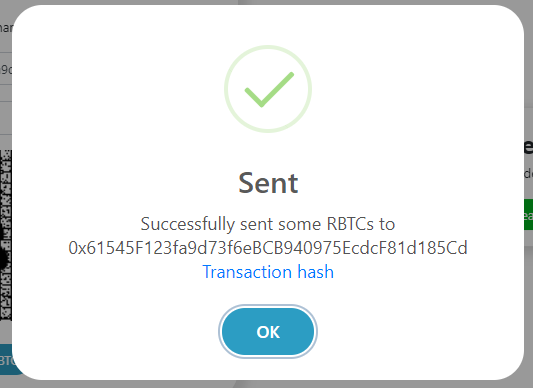

# RSK faucet

The Smart Bitcoin (R-BTC) is the token used to pay for the execution of transactions in RSK. 
In the faucet you can get it for the RSK Testnet.

## TODO: What is a faucet?

## Get some testnet R-BTCs at faucet

Copy the address from your wallet.

Go to [faucet.testnet.rsk.co](https://faucet.testnet.rsk.co/)

Enter your wallet address and pass the CAPTCHA.

Wait a few seconds...

You can see the transaction hash, for example [`0xf63c45dabd52e0b44f4cf15825985e9ddfe790b4323a88a3531f762a417f9011`](https://explorer.testnet.rsk.co/tx/0xf63c45dabd52e0b44f4cf15825985e9ddfe790b4323a88a3531f762a417f9011).

Now I have 0.05 tR-BTC!

## Once a day

You can ask tR-BTCs in the faucet once a day.

